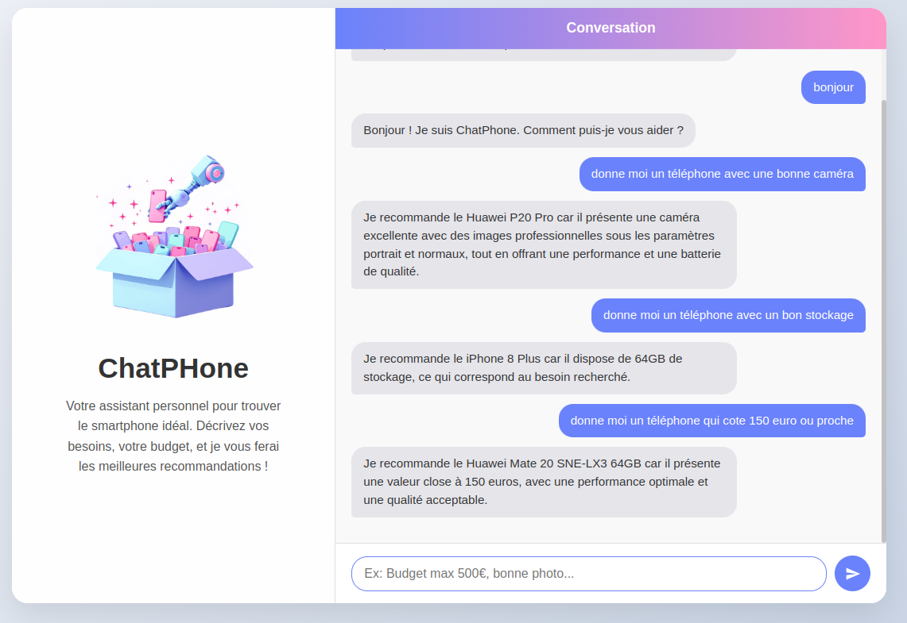
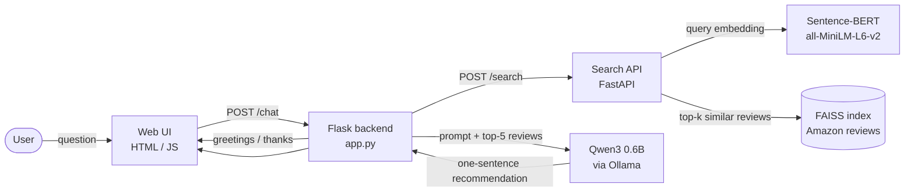

# ChatPhone: a RAG Chatbot for Smartphone Recommendation

**ChatPhone** answers questions like *"give me a phone with a good camera"* or *"a phone around 150 euros"* with **one recommendation grounded in real Amazon customer reviews**. A plain LLM can recommend products that don't exist or aren't in the catalogue. ChatPhone uses **Retrieval-Augmented Generation (RAG)**: it first retrieves the most relevant reviews, then asks a small local LLM to recommend a phone **only from that context**.

> 🎓 Individual project, L3 Computer Science (Linguistics course), Université Paris Cité, 2024–2025
> Report (French): [`docs/report_fr.pdf`](docs/report_fr.pdf)

<p align="center">
  
</p>

---

## Architecture



| Component | Role |
|---|---|
| `notebooks/01_preprocessing_and_search_api.ipynb` | Data preparation, embeddings, FAISS indexes, VADER sentiment indexes and the original search API (Colab + ngrok) |
| `search_api/search_api.py` | The same search API as a **standalone local service** (no Colab, no ngrok) |
| `backend/app.py` | Orchestrator: handles small talk, retrieves reviews, builds the prompt and calls the LLM |
| `frontend/index.html` | Chat interface |

## How it works

1. **Data:** the Amazon Cell Phones Reviews dataset. The product table and the reviews table are joined on `asin`, the useful columns are kept (brand, product title, price, ratings, review title and body), and rows with missing values are dropped.
2. **Document text:** each review becomes `Brand … Price … Product … Review Title … Review …`.
3. **Embeddings and index:** Sentence-BERT `all-MiniLM-L6-v2` produces 384-dimensional vectors, stored in a FAISS `IndexFlatL2` for nearest-neighbour search.
4. **Sentiment filtering:** VADER scores each review, and two extra indexes hold only positive (compound > 0.05) or only negative (< -0.05) reviews.
5. **Retrieval:** the question is embedded and the 20 closest reviews are returned.
6. **Generation:** the top 5 reviews are inserted into a **constrained prompt** for Qwen3 0.6B (running locally with Ollama). The prompt imposes three rules:
   - recommend **exactly one** phone, in one sentence: *"Je recommande le [brand model] car [short justification]"*;
   - never copy reviews verbatim;
   - refuse off-topic questions, and say so when no phone in the retrieved context matches.

## Examples

| Question | ChatPhone's answer |
|---|---|
| *donne moi un téléphone avec une bonne caméra* | Je recommande le Huawei P20 Pro car il présente une caméra excellente… |
| *donne moi un téléphone avec un bon stockage* | Je recommande le iPhone 8 Plus car il dispose de 64GB de stockage… |
| *donne moi un téléphone qui coûte 150 euros ou proche* | Je recommande le Huawei Mate 20 SNE-LX3 64GB car il présente une valeur proche de 150 euros… |

## Running it locally

Requirements: Python 3.10+ and [Ollama](https://ollama.com/download).

```bash
pip install -r requirements.txt
ollama pull qwen3:0.6b

# 1. Put the dataset in data/ (see data/README.md), then start the search API.
#    The first run encodes the ~59,000 reviews and caches them in cache/
#    (about 30-60 min on a laptop CPU, a few minutes on a GPU; later runs start instantly).
python search_api/search_api.py --data-dir data --cache-dir cache      # http://127.0.0.1:8000
#    Quick test on a random sample of 3,000 reviews (about 1-2 min on CPU):
python search_api/search_api.py --limit 3000

# 2. Start the chatbot backend (it uses http://127.0.0.1:8000 by default)
python backend/app.py                                                  # http://localhost:5000

# 3. Open frontend/index.html in your browser
```

To use the Colab version of the search API instead, run the notebook (with `NGROK_AUTHTOKEN` set) and pass its public URL to the backend: `python backend/app.py https://<your-tunnel>.ngrok-free.app`.

## Limitations and next steps

- **Small LLM:** Qwen3 0.6B runs on a laptop but sometimes ignores the rules. For example, it answered an off-topic question (*"2+2"*) with the "not enough information" message instead of the refusal message.
- **Retrieval by review similarity:** prices are part of the embedded text, but budget constraints aren't filtered explicitly. Numeric filters (price, storage) plus a re-ranking step would help.
- **Sentiment indexes** are built (the API accepts `"sentiment": "positive"`), but the backend doesn't use them yet. Without them, a query like *good camera* also retrieves reviews complaining about the camera, so using positive reviews first for recommendations is a natural next step.
- **Evaluation:** there is no quantitative evaluation yet. A small set of annotated questions (retrieval precision, answer faithfulness) would make it measurable.
- The dataset is from 2019, so recent phones are missing.

## Tech stack

Python · Sentence-Transformers · FAISS · VADER · pandas · FastAPI · Flask · Ollama (Qwen3) · HTML/CSS/JavaScript · Google Colab · ngrok
